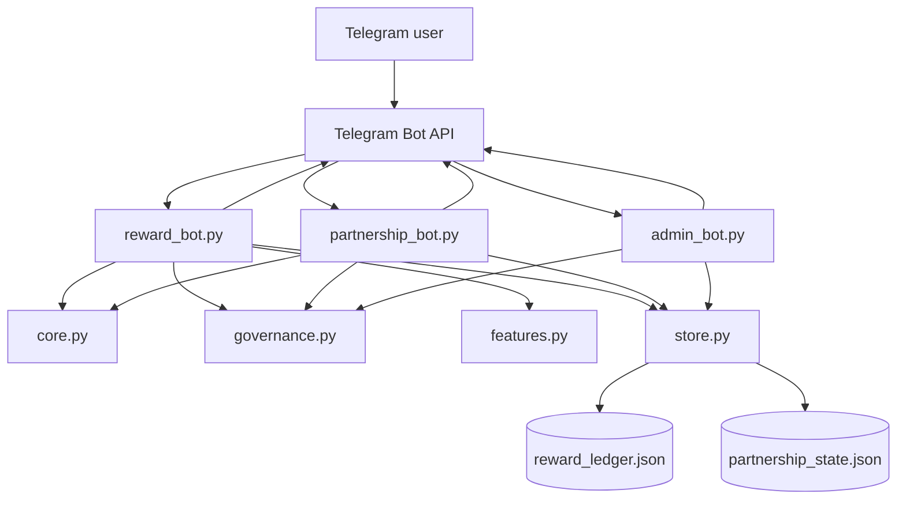
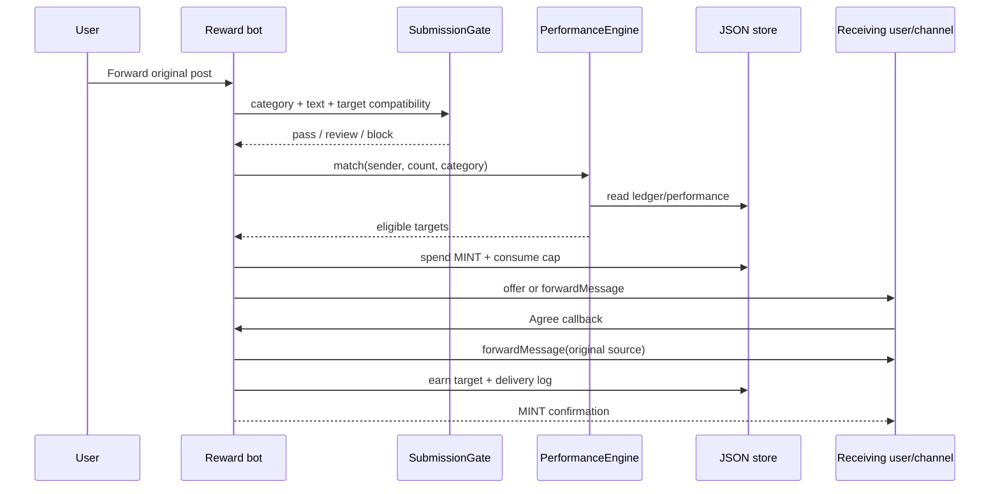
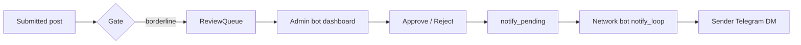
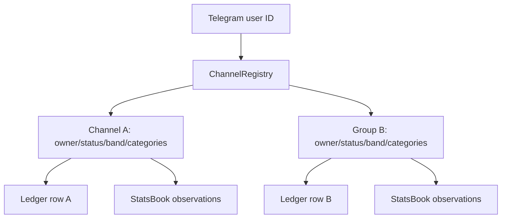

# CLICKMINT Partner Bots — Master System Documentation

> **Source of truth:** this document describes the code currently in this repository. It does not describe a planned SaaS backend, database service, commission system, webhook service, or analytics platform unless the source code actually contains one.
>
> **Audit basis:** Python modules, shell scripts, service files, tests, current configuration templates, and the existing project documentation were inspected. Where the repository does not determine an answer, it is marked **UNKNOWN / NOT DETERMINABLE FROM AVAILABLE SOURCE**.

## Table of Contents

1. [System Status and Scope](#1-system-status-and-scope)
2. [Architecture Overview](#2-architecture-overview)
3. [Component Map](#3-component-map)
4. [Storage and Database Architecture](#4-storage-and-database-architecture)
5. [Admin System](#5-admin-system)
6. [Partnership System](#6-partnership-system)
7. [Reward Bot System](#7-reward-bot-system)
8. [Other Components](#8-other-components)
9. [Authentication and Authorization](#9-authentication-and-authorization)
10. [Business Rules and Formulas](#10-business-rules-and-formulas)
11. [End-to-End Workflows](#11-end-to-end-workflows)
12. [Data Flow](#12-data-flow)
13. [Bot Commands and Events](#13-bot-commands-and-events)
14. [Module and Function Inventory](#14-module-and-function-inventory)
15. [Notifications and Background Processes](#15-notifications-and-background-processes)
16. [Security, Validation, and Error Handling](#16-security-validation-and-error-handling)
17. [Deployment and Operations](#17-deployment-and-operations)
18. [Diagrams](#18-diagrams)
19. [Testing and Audit Coverage](#19-testing-and-audit-coverage)
20. [Known Limitations and Unknowns](#20-known-limitations-and-unknowns)
21. [Troubleshooting](#21-troubleshooting)
22. [Technical Glossary](#22-technical-glossary)

---

## 1. System Status and Scope

CLICKMINT is a set of **three long-running Telegram polling bots**:

| Bot | Source | Purpose | Store |
|---|---|---|---|
| Reward / Exchange bot | `reward_bot.py` | Niche post exchange, MINT wallet, delivery matching, referrals, queues, destination management | `reward_ledger.json` by default |
| Partnership bot | `partnership_bot.py` | Curated partner registration, receive contracts, partnership offers, review | `partnership_state.json` by default |
| Admin bot | `admin_bot.py` | Owner-only dashboard for review queues, contracts, caps, and invite codes | Reads both stores |

The bots use **long polling**, not a custom HTTP backend. `aiogram` receives Telegram updates and dispatches them to handler functions. There is no separate REST API server in the repository.

The persistence layer is a pair of JSON files accessed through `store.JsonStore`. The three processes are expected to run on the same host and share the same data directory. `JsonStore` uses atomic replacement and a read/merge/write strategy; POSIX systems also get an `fcntl` advisory lock. On Windows, `fcntl` is unavailable and the lock becomes a no-op, although atomic writes and merge behavior remain.

The public currency is **🪙 MINT**. Existing internal ledger keys such as `balance`, `earned`, and `spent` remain for compatibility with existing JSON data and tests.

### Current verified test status

At the time of this documentation pass, the repository's local audit suites report:

```text
Core tests:       28 passed
Governance tests: 33/33 passed
Bot wiring tests: 26 passed
Feature tests:     6/6 passed
Offline simulation: clean
```

These are offline tests. They do not prove that a specific `.env` token is valid, that a network permits `api.telegram.org`, or that a real Telegram destination has granted bot permissions.

---

## 2. Architecture Overview

### 2.1 Runtime architecture

```text
┌──────────────────────┐
│ Telegram users/admins│
└──────────┬───────────┘
           │ Telegram Bot API updates / sendMessage / forwardMessage
           ▼
┌──────────────────────────────────────────────────────────────┐
│ aiogram Dispatcher processes                                  │
│                                                              │
│ reward_bot.py       partnership_bot.py       admin_bot.py    │
└─────────┬──────────────────┬──────────────────────┬─────────┘
          │                  │                      │
          ▼                  ▼                      ▼
   reward engine       partnership engine       dashboard logic
   core.py             core.py/governance.py   reads both stores
          │                  │                      │
          ▼                  ▼                      ▼
 reward_ledger.json   partnership_state.json   same two JSON files
```

### 2.2 Shared code layers

```text
Telegram transport and handlers
        │
        ├── reward_bot.py
        ├── partnership_bot.py
        └── admin_bot.py
        │
        ▼
Presentation / menus
        ├── ui.py
        ├── currency.py
        └── governance.TERMS_TEXT
        │
        ▼
Rules and domain services
        ├── core.py
        ├── governance.py
        ├── features.py
        ├── channel_registry.py
        └── scheduler.py
        │
        ▼
Persistence / configuration
        ├── store.py
        ├── config.py
        └── JSON state files
```

### 2.3 Communication model

- User-to-bot communication is through Telegram updates.
- Bot-to-user and bot-to-channel communication uses Telegram Bot API methods through `aiogram`.
- The reward and partnership bots do not call each other's Python functions at runtime. They share patterns and core classes but have separate stores.
- The admin bot does not call the network bots over HTTP. It writes review decisions and notification flags to the relevant store; the network bot that owns the user's conversation later sends the notification.
- The admin bot reads the same JSON files the network bots write.
- There are no webhooks in the repository.
- There is no Postgres, MySQL, Redis, SQLite database, message broker, or external reward/payment API in the current implementation.

### 2.4 External systems

| External system | Use | Required? |
|---|---|---|
| Telegram Bot API | Bot identity, polling, messages, forwarding, channel/group operations, basic member count | Required for live bots |
| Telegram BotFather | Creation and issuance of bot tokens | Operational prerequisite |
| `@userinfobot` | Suggested way to discover owner numeric Telegram ID | Setup aid, not called by code |
| `python-dotenv` | Loads local `.env` into process environment | Required for `.env` loading; environment variables can be used instead |
| Telethon / MTProto | Optional live channel view observer in `views_provider.py` | Not in `requirements.txt`; not wired by default |
| GitHub | Source hosting and optional CI/deploy workflow | Deployment/operations only |
| systemd | Optional Linux process supervision | Deployment only |

---

## 3. Component Map

### 3.1 Repository files

| File | Responsibility |
|---|---|
| `reward_bot.py` | Main reward/exchange Telegram handlers and orchestration |
| `partnership_bot.py` | Curated partnership Telegram handlers and orchestration |
| `admin_bot.py` | Owner dashboard and privileged review/admin operations |
| `core.py` | Ledger, forwarding checks, tiering, contracts, delivery log, reports, performance matching |
| `governance.py` | Caps, submission gate, posting terms, human review queue, partner contracts, role registry |
| `features.py` | Referral ledger, available-post queue, notification bubble state, announcements, rank visibility, basic stats, reroute state |
| `channel_registry.py` | Per-user multi-destination registry for channels and groups |
| `scheduler.py` | Persistent UTC scheduled-delivery records and retry state |
| `store.py` | Atomic JSON persistence and cross-process merge logic |
| `ui.py` | Shared role menus, badge formatting, audit submenu |
| `currency.py` | Public 🪙 MINT copy and wallet formatting |
| `config.py` | Environment and `.env` configuration |
| `preflight.py` | Local configuration/token/storage validation |
| `branding.py` | Bot profile copy validation and optional Bot API profile update |
| `views_provider.py` | Optional Telethon observer factory for real channel view data |
| `simulate.py` | Offline, mocked multi-user conversation simulation |
| `test_core.py` | Core engine tests |
| `test_governance.py` | Governance and role tests |
| `test_bots.py` | Dispatcher, menu, funnel, permission, and bot wiring tests |
| `test_features.py` | Feature-service tests |
| `requirements.txt` | Runtime dependencies |
| `.env.example` | Configuration template; it contains placeholders and must not be used as live credentials |
| `setup.sh` | Interactive setup for `.env`, dependencies, and preflight |
| `run_bots.sh` | Local start/stop/status/log wrapper |
| `deploy.sh` | Linux package, clone/pull, venv, systemd deployment script |
| `clickmint*.service` | Optional systemd units |
| `.github/workflows/tests.yml` | CI test workflow definition |
| `.github/workflows/deploy.yml` | Optional SSH deployment workflow definition |

### 3.2 Process relationships

The reward and partnership processes each construct their own instances of `JsonStore`, `CreditLedger`, `PerformanceEngine`, `DeliveryLog`, `ReviewQueue`, and `RoleRegistry`. They do not share in-memory objects. Their intended shared state is through files on disk.

The admin process constructs `JsonStore` objects pointed at both configured paths and creates read/write domain objects over those stores. This means the admin dashboard is eventually consistent with the network bots and depends on the same filesystem and permissions.

---

## 4. Storage and Database Architecture

### 4.1 Storage model

The system is a **document-shaped JSON store**, not a relational database. Each state file is one top-level JSON object. Individual top-level keys act like collections.

Default paths from `config.py`:

```text
./reward_ledger.json
./partnership_state.json
```

`STORE_DIR` can relocate both files. The admin bot must use the same paths to see the same state.

### 4.2 `JsonStore` behavior

Implemented in `store.py`:

1. Load JSON if the file exists and is valid.
2. Keep an in-memory dictionary.
3. Mark keys changed through `__setitem__` or `mark_dirty`.
4. At `sync()`, acquire a best-effort lock.
5. Re-read the disk file.
6. Merge local dirty keys over disk data.
7. Write a temporary file in the same directory.
8. Flush and replace the target atomically.
9. Clear the dirty-key set.

Invalid or unreadable JSON is treated as empty data by `_read_disk()`. This prevents a crash during load but can conceal corruption; operational backups are still important.

### 4.3 Main collections / keys

#### Reward store (`reward_ledger.json`)

| Key | Shape | Purpose | Writers/readers |
|---|---|---|---|
| `ledger` | username → member dict | Balance, audience size, tier, status, counters, contract types, user ID, direct mode | Reward bot, admin, core/performance |
| `delivery_log` | list of delivery rows | Audit trail for offers, agreements, delivery, failure, reports | Reward bot/admin |
| `reports` | list | Receiver reports awaiting human action | Reward bot/admin |
| `review_queue` | list | Borderline submissions and decisions | Reward bot/admin |
| `roles_users` | Telegram ID → role record | Admin role and scopes | Reward/admin bot |
| `roles_invites` | invite code → invite record | One-time admin invitations | Reward/admin bot |
| `sessions` | Telegram ID → session dict | Multi-step UI state with timestamps | Reward bot |
| `managed_channels` | stable destination key → destination dict | Multiple channels/groups owned by users | Reward bot; admin reads |
| `referrals` | codes and referred-user records | Referral attribution and completion state | Reward bot |
| `available_posts` | list | Persistent post queue and claims | Reward bot |
| `availability_bubbles` | Telegram ID → notification record | One replaceable availability message per user | Reward bot |
| `announcements` | list | Owner announcements | Reward bot |
| `settings` | settings dict | Rank visibility and similar settings | Reward bot |
| `channel_stats` | destination → samples/latest | Basic real observations | Reward bot |
| `reroute_queue` | list | Twelve-hour reroute state | Reward bot |
| `scheduled` | list | Future UTC delivery records | Reward bot/scheduler |

#### Partnership store (`partnership_state.json`)

| Key | Shape | Purpose |
|---|---|---|
| `ledger` | username → member dict | Partner identity, size, status, contract types, direct mode |
| `partner_contracts` | list | Owner-mediated partner contracts |
| `delivery_log` | list | Partnership offers and outcomes |
| `reports` | list | Partnership reports |
| `review_queue` | list | Partnership borderline submissions |
| `roles_users`, `roles_invites` | maps | Partnership-scoped roles/invites |
| `sessions` | map | Contract and destination-registration sessions |
| `managed_channels` | map | Partnership destination ownership records |

The exact set of keys can grow when a class is instantiated because constructors initialize missing collections lazily.

### 4.4 Important record fields

#### Ledger member

Typical fields created in `CreditLedger._m()`:

```text
size, tier, balance, earned, spent, times_shared,
is_owner, is_partner, accept_types, receive_types,
delivered_today, last_deliver_day, status,
offered, posted, invalid_posts, direct_mode,
user_id, cap_used_today, last_cap_day
```

#### Managed destination

Created by `ChannelRegistry.add()`:

```text
chat_id, username, owner_id, kind, categories, size,
bot_added, status, band, created_at, updated_at
```

The destination registry is the ownership layer. The ledger is the performance/economy row. They are related by the destination username/key but are not enforced by a foreign-key database.

#### Delivery log row

Typical fields include:

```text
ts, bot, sender, source, post_type, target_channel,
mode, status, forward_valid, style, source_chat_id,
source_message_id, error, scheduled_at
```

#### Scheduled row

Created by `Scheduler.schedule()`:

```text
id, at, target, sender, post_type,
from_chat_id, from_message_id, fire_once, done,
attempts, scheduled_ts, last_error, note
```

### 4.5 Relationships

```text
Telegram user ID
      │
      ├── RoleRegistry role/scope
      ├── ChannelRegistry owner_id ──> many destinations
      └── Ledger member.user_id ──> username ledger row

Destination username/key
      │
      ├── ledger size/status/band/balance
      ├── managed_channels kind/categories/bot_added
      ├── delivery_log target_channel
      ├── scheduled target
      └── stats samples/latest

Review item ID ──> review_queue row ──> notification flag ──> network bot DM
```

There are no declared SQL primary keys or foreign keys. IDs are application-generated UUID fragments, hex codes, or monotonic integer queue IDs.

---

## 5. Admin System

### 5.1 Purpose

`admin_bot.py` is an owner-facing dashboard bot. It is not a general backend. It reads both JSON stores and provides privileged views/actions for:

- Dashboard totals
- Daily caps
- Review queues for reward and partnership
- Partnership contracts
- Admin invite generation

The admin bot's own `/start` is restricted to the configured numeric owner. A non-owner receives a lock message.

### 5.2 Admin identity and permissions

There are two related authorization systems:

1. `admin_bot.py.is_owner(uid)` — strict numeric ID comparison for the admin bot dashboard.
2. `governance.RoleRegistry` — owner/admin/user role model for the network bots. Admins can have `reward`, `partnership`, or both scopes.

A role record looks conceptually like:

```json
{
  "role": "admin",
  "scope": ["reward"],
  "granted_by": "owner-id",
  "active": true
}
```

The admin dashboard itself is owner-only in the current source; scoped admins use the reward or partnership bot panels after redeeming an invite.

### 5.3 Dashboard data

`admin_bot._dashboard_text()` loads both stores and calculates:

- Ledger member count
- Reward pending review count
- Partnership pending review count
- Open partnership contracts
- Pending report count
- Privileged destination category counts
- Active admin count

The dashboard does not query Telegram live for every render.

### 5.4 Admin dashboard buttons

| Callback | Handler | Permission | Result |
|---|---|---|---|
| `dash:cap` | `show_caps()` | Owner | Per-destination band/status/cap list |
| `dash:rev:reward` | `show_review()` | Owner | Reward queue |
| `dash:rev:partnership` | `show_review()` | Owner | Partnership queue |
| `dash:contracts` | `show_contracts()` | Owner | Open contract list |
| `dash:admins` | `show_admins()` | Owner | Admin list and invite buttons |
| `dash:back` | `dash()` | Owner | Dashboard home |
| `rv:approve/reject:*` | `review_decision()` | Owner | Writes decision and notification flag |
| `inv:*` | `gen_invite()` | Owner | Creates one-time scoped invite |

### 5.5 Review decision flow

1. Network bot submits borderline content to its `ReviewQueue`.
2. Admin dashboard reads the appropriate store.
3. Owner taps Approve or Reject.
4. `ReviewQueue.decide()` changes status and records timestamp/note.
5. `mark_notify()` sets `notify_pending` and `notify_via`.
6. The network bot's `notify_loop()` finds the item.
7. The network bot resolves the sender's stored Telegram ID.
8. The network bot sends the sender the result and clears the notification flag.

The admin bot is used for the decision; the network bot sends the user notification because it has the sender's conversation context.

### 5.6 Admin limitations

- There is no separate admin database.
- There is no browser dashboard.
- There is no API token/session for admin users beyond Telegram identity and invite records.
- The repository does not implement a formal audit log for every admin dashboard click; delivery and report actions are recorded, while some display-only actions are not.

---

## 6. Partnership System

### 6.1 Purpose

`partnership_bot.py` handles curated partner exchange separately from the reward exchange economy. It uses a separate JSON file and does not share balances with the reward bot.

### 6.2 Registration

The partnership bot supports:

- `/start @name <subscriber_count>` legacy registration
- Button-led **My channels / groups → Add channel/Add group** registration
- `/mychannels`

Registration creates/updates a ledger row and a `ChannelRegistry` destination row. The bot-added flag begins false unless later verified by code. The source asks users to add the bot as an admin for direct posting and accurate statistics.

### 6.3 Contract setup

`/contract` starts a two-phase inline selector:

1. Select types the partner will accept/publish.
2. Select types the partner wants to receive.
3. `Contract.set_contract()` validates types against `POST_TYPES`, deduplicates, sorts, and stores them.

`allows_receive()` treats an empty receive list or a list containing `General` as accepting any type.

### 6.4 Partnership delivery

1. User accepts posting terms and selects a niche.
2. User forwards a real message.
3. `on_partner_forward()` checks identity, terms, category, cap, and gate.
4. It finds other ledger rows with `is_partner`, active status, and matching `receive_types`.
5. Each target receives an offer with Agree, Disagree, and Report buttons.
6. `chain_choice()` records agreed/skipped/report outcomes.
7. A report is persisted as pending for human action.

### 6.5 Partner contracts and owner mediation

`PartnerContractRegistry` stores:

```text
id, a, b, contract, status, opened,
renewed, close_requested, closed
```

Supported statuses:

```text
ACTIVE, RENEWED, CLOSE_REQUESTED, CLOSED
```

Operations:

- `open()` — creates an active record.
- `renew()` — appends a renewal event.
- `request_close()` — a partner requests closure but it is not final.
- `finalize_close()` — owner makes closure final.
- `between()` — finds contracts between two partners.
- `list()` — filters contracts by status.

### 6.6 Rewards, commissions, and referrals

The partnership system does **not** contain a separate commission/payment engine. There is no fiat settlement, blockchain token contract, payout provider, commission table, or partner commission formula in the repository.

The reward bot has the 🪙 MINT ledger and referral feature. Partnership records are contract/delivery records. Any assumption that partnership activity pays a separate commission is **UNKNOWN / NOT DETERMINABLE FROM AVAILABLE SOURCE** and is not implemented.

### 6.7 Partnership errors

- Invalid registration numbers return usage/help text.
- Invalid contract post types are rejected.
- A partner cannot act on its own offer.
- Unreachable partners are logged and do not abort the entire offer loop.
- Reports are pending and do not automatically ban a partner.
- Missing bot-admin/direct permissions prevent direct partnership opening or delivery.

---

## 7. Reward Bot System

### 7.1 Purpose

`reward_bot.py` is the main exchange bot. Its economy is a strict 1:1 MINT system:

- Sharing another member's post can earn 🪙 1 MINT.
- Sending one of your own posts to one destination costs 🪙 1 MINT.
- One post to five destinations costs 🪙 5 MINT.
- Users must satisfy the earn-first rule before their own post is distributed.
- The owner is exempt from MINT costs and daily caps.

### 7.2 Startup objects

At import/startup, the reward bot constructs:

```text
JsonStore(config.REWARD_STORE_PATH)
CreditLedger
DeliveryLog
ReportRegistry
PerformanceEngine
Scheduler
ChannelRegistry
ReferralLedger
AvailablePostQueue
BubbleNotifier
AnnouncementBoard
RankVisibility
StatsBook
ReroutePlanner
SubmissionGate
ReviewQueue
PartnerContractRegistry (legacy/shared owner panel functionality)
RoleRegistry
Bot
Dispatcher
```

### 7.3 User identity

`_uname()` creates a handle from Telegram username, falling back to numeric Telegram ID. `bind_identity()` is an outer middleware that records `user_id` on every non-bot update before the specific handler executes. This allows owner recognition even if the owner's first action is `/balance` or a menu tap.

The ledger owner test accepts:

- `is_owner` record flag;
- reserved case-insensitive `OWNER_USERNAME` (`@ClickMintHQ` in `core.py`);
- stored `user_id == config.OWNER_USER_ID`.

### 7.4 Destination registry

`ChannelRegistry` allows a user to own multiple channel/group records. Each destination has independent categories, kind, bot-access state, band, and status. Button registration asks for destination name/link and audience count. Commands remain as a fallback.

### 7.5 Post submission

The submission funnel is:

```text
Submit a post
  → posting terms
  → accept
  → niche category
  → forward/direct style
  → loud/silent notification
  → forward original Telegram message
  → gate and target matching
  → select number of destination pairs
  → charge MINT and sender cap
  → direct forward or target offer
```

Pinning is intentionally not available in the current reward flow.

### 7.6 Original message preservation

A genuine forwarded message is identified by `is_forward()` using Telegram forward fields. `_pending_from()` stores:

```text
from_chat_id
from_message_id
source
post_type
style
ntf
```

Direct delivery uses `bot.forward_message()`. Chain completion also uses `forward_message()` when source identifiers are available. This preserves original attribution, media, captions, and inline buttons. The source code explicitly avoids rebuilding forwarded content as plain text.

### 7.7 Matching

`PerformanceEngine.match()` chooses receiver usernames based on:

- sender performance band;
- receiver status and minimum status;
- category acceptance through `allows_receive()`;
- same-band preference and cautious widening;
- subscriber size only as a tiebreaker;
- requested destination count.

The full scoring inputs are reach, engagement, reliability, and reputation when available. Missing view data is not fabricated.

### 7.8 MINT lifecycle

Ledger fields:

```text
balance  — spendable current MINT
 earned  — cumulative earned MINT, used by earn-first
 spent   — cumulative charged MINT
 times_shared — share count proxy
```

Methods:

- `earn(username, amount=1)` — increments balance, earned, and times shared; owner is exempt.
- `can_spend()` — verifies owner exemption, earn-first, and positive balance.
- `spend()` — charges number of post/destination pairs.
- `refund()` — returns MINT for undelivered pairs without increasing earned.
- `balance()` — returns public wallet values.

### 7.9 Referrals

`ReferralLedger` supports `/refer` and `/joinref CODE`:

1. Referrer creates a random code.
2. New user attaches once to the code.
3. No reward is issued at link creation.
4. After the referred member completes a distribution, `complete_forward()` awards the referrer 🪙 1 MINT.
5. Completion is idempotent; the same referred user cannot trigger a second bonus.

### 7.10 Available posts and bubble counter

`AvailablePostQueue` stores unclaimed posts, orders owner posts first, supports claims, counts active items, and retains claimed history. `BubbleNotifier` stores one replaceable Telegram notification per user. `notify_loop()` edits the existing message where possible rather than sending a new notification for each count change.

The dashboard button displays the active count with a `99+` ceiling.

### 7.11 Basic statistics and connection state

`StatsBook` stores only observed values:

```text
subscribers, views, reactions, forwards, observed_at
```

`/scan` uses the Bot API member-count operation where available. The current basic stats path does not claim that the Bot API can read every historical channel view/reaction metric. `views_provider.py` contains an optional MTProto/Telethon observer, but it is not part of `requirements.txt` and is not enabled by default.

A destination with `bot_added=False` receives the fixed unconnected allowance of 3 posts/day. A connected destination uses the dynamic band/size calculation.

### 7.12 Owner controls

The owner can:

- bypass terms/caps/MINT;
- route to all matching destinations;
- publish `/announce` messages;
- inspect `/categorystats`;
- toggle public rank with `/rankpublic on|off`;
- manage admin invite codes;
- review reports and borderline submissions.

---

## 8. Other Components

### 8.1 `governance.py`

Pure rules layer. It contains the daily cap formula, content gate, posting terms, review queue, partnership registry, and roles. It has no Telegram dependency.

### 8.2 `channel_registry.py`

Ownership and destination-management layer. It is deliberately separate from `CreditLedger` so one person can own multiple destinations with independent states.

### 8.3 `scheduler.py`

A JSON-backed UTC queue. It does not depend on a Telegram schedule API. The bot's `scheduler_loop()` periodically calls `run_due()`, which forwards stored source messages and marks success/failure.

### 8.4 `views_provider.py`

Optional synchronous wrapper around a Telethon client. It resolves a channel, reads recent messages, requests non-incrementing views, and returns average views, forwards, and subscribers. It requires external API ID/hash and an authorized user session. It is not used unless explicitly wired into `PerformanceEngine.views_provider`.

### 8.5 `branding.py`

Contains name, description, About, commands, and logo paths for the three bots. `validate_all()` checks Telegram length constraints. `apply()` uses Bot API profile methods. `--check` validates without sending anything.

### 8.6 `preflight.py`

Checks token shape, duplicate tokens, owner ID, store directory, optional `python-dotenv`, and live `get_me()` responses. `--offline` skips network calls.

### 8.7 `console.py`

On Windows, attempts UTF-8 output reconfiguration with replacement error handling so status emoji do not crash a diagnostic process. It safely does nothing for streams that cannot be reconfigured.

### 8.8 Shell operations

- `setup.sh` — four-question local setup; hidden token input; writes `.env` with restrictive permissions where supported.
- `run_bots.sh` — creates `logs/` and `run/`, launches each bot with `nohup`, tracks PIDs, checks status, follows logs.
- `deploy.sh` — Ubuntu/Debian-oriented system package, venv, GitHub clone/pull, preflight, service install and restart.

---

## 9. Authentication and Authorization

### 9.1 Bot authentication

Each process authenticates to Telegram using a separate BotFather token loaded from:

```text
REWARD_BOT_TOKEN
PARTNER_BOT_TOKEN
ADMIN_BOT_TOKEN
```

Tokens are not hardcoded. `.env.example` contains placeholders only. A live preflight calls each bot's `get_me()`.

### 9.2 User authentication

Telegram authenticates the user to the bot through `from_user.id` in each update. The application does not implement passwords, sessions, OAuth, JWT, or email accounts.

### 9.3 Authorization

- Owner: numeric `OWNER_USER_ID` or owner record match.
- Admin: role created by one-time owner-issued invite; has one or more scopes.
- User: default role.
- Destination access: `ChannelRegistry.owner_id` prevents another Telegram user from editing/removing a destination.
- Admin bot dashboard: owner-only numeric check.
- Reward/partnership panel: `RoleRegistry.has_access(uid, scope)`.

### 9.4 Invite security

`RoleRegistry.create_invite()` creates a random one-time code. `redeem_invite()` marks it used and creates an active scoped admin record. The code is not reusable. The source does not implement expiration timestamps for invites.

---

## 10. Business Rules and Formulas

### 10.1 Tier assignment

`core.tier_for_size()` assigns subscriber counts to configured tiers:

```text
T1: 700–1000
T2: 2000–3000
T3: 4000–5000
T4: 5001+
```

Gap values are assigned to the nearest band midpoint. Tier is retained as information and a compatibility field; performance band is the primary match key.

### 10.2 Connected daily cap

`governance.daily_post_cap(size, band, status, is_owner, connected)`:

```text
owner                         → -1 (unlimited)
RESTRICTED or REMOVED        → 0
not connected                 → 3
connected ACTIVE              → floor(base_size_cap × band_multiplier, minimum 1)
```

Connected base caps:

| Audience size | Base |
|---:|---:|
| `< 1,000` | 1 |
| `1,000–2,499` | 2 |
| `2,500–4,999` | 3 |
| `5,000+` | 4 |

Band multipliers:

| Band | Multiplier |
|---|---:|
| A | 1.0 |
| B | 0.75 |
| C | 0.5 |

The returned integer has a minimum of 1 for connected active destinations.

### 10.3 Submission gate

A category must be in `POST_CATEGORIES`, and when a destination has a non-empty receive list, the category must be accepted or `General` must be present. Text is classified as:

```text
block  → obvious prohibited pattern
review → ambiguous/suspicious pattern; human queue
pass   → no matched pattern
```

One report does not automatically ban a user. Human action can set `WATCH`, `RESTRICTED`, or `REMOVED`.

### 10.4 Forward-only rule

Unless `FORWARD_ONLY` is changed in source, a message must expose `forward_from`, `forward_from_chat`, or `forward_origin`. Typed/reuploaded content is not accepted as a genuine forward.

### 10.5 Pair accounting

A distribution is charged after matching and before delivery. Charge is based on actual target count, not the requested maximum. A failed cap transaction refunds MINT. The existing implementation has compatibility handling for legacy offer rows created before source IDs were persisted.

### 10.6 Performance score

`PerformanceEngine.score()` considers:

- Reach: views/subscribers normalized against a 60% reference.
- Engagement: reactions + forwards relative to views.
- Reliability: posted/offered.
- Reputation: confirmed reports and invalid post penalties.

Weights in `core.py` are:

```text
reach        0.40
engagement   0.25
reliability  0.25
reputation   0.10
```

Weights are renormalized over available components. Thresholds:

```text
A >= 0.66
B >= 0.33
C < 0.33
```

### 10.7 Owner priority

Owner offers are flagged in `AvailablePostQueue` and sorted before normal unclaimed posts. The owner is excluded from their own target list.

---

## 11. End-to-End Workflows

### 11.1 First-time user opens reward bot

1. Telegram sends `/start` update.
2. `bind_identity()` stores the sender ID if needed.
3. `start()` asks the user to register and renders the user menu.
4. The menu shows Submit, cap, destinations, MINT wallet, available-post count, and rank. Audit is not shown to a standard user.
5. No database row is required until registration or another action creates one.

### 11.2 Button-led destination registration

1. User taps **My channels / groups**.
2. `menu_nav()` reads `ChannelRegistry.mine(user_id)`.
3. User taps **Add channel** or **Add group**.
4. Session stores `destination_phase=name` and destination kind.
5. `destination_capture()` receives the public username/link.
6. The session advances to `destination_phase=size`.
7. User sends an integer audience count.
8. `ChannelRegistry.add()` creates the destination with `bot_added=False`, band C, and default General category.
9. `CreditLedger.register()` creates/updates the economy row with onboarding seed MINT.
10. A structured registration response and refreshed menu are returned.

### 11.3 User accepts terms and submits

1. User taps Submit.
2. Bot displays `TERMS_TEXT` using HTML formatting.
3. User taps Accept.
4. Session records `accepted_terms=True`.
5. User selects a valid category.
6. User selects delivery style and notification mode.
7. User forwards the original Telegram message.
8. `is_forward()` rejects a copied/typed message.
9. The content gate checks category, target compatibility, and prohibited patterns.
10. A block is refused immediately; a review item is persisted; a pass continues.
11. An `available_posts` row and reroute row are created.
12. The bot offers a number of post/destination pairs based on wallet and sender cap.
13. The user taps a number.
14. Matching finds real eligible targets.
15. Loud notification filters to group destinations; silent can target channel/group.
16. MINT is charged for actual targets and cap slots are consumed.
17. Direct targets receive `forward_message()` immediately; chain targets receive an offer.
18. Audit rows are written.

### 11.4 Receiver completes an offer

1. Receiver taps Agree.
2. The callback identifies sender and receiver.
3. Self-agreement is rejected.
4. The latest matching offered audit row is loaded.
5. If source IDs exist, the bot forwards the original message to the receiver destination.
6. Receiver ledger earns 🪙 1 MINT.
7. Receiver reliability counters are updated.
8. Audit status changes to delivered/agreed.
9. The receiver gets a confirmation message.

### 11.5 Referral

1. User sends `/refer`.
2. `ReferralLedger.create_code()` creates a random code.
3. New user sends `/joinref CODE`.
4. `attach()` records the referrer and prevents duplicate attachment.
5. Referred user completes a distribution.
6. `complete_forward()` marks completion and calls `ledger.earn()` for the referrer.
7. A second completion is ignored.

### 11.6 Admin review

1. A borderline post is submitted to `ReviewQueue`.
2. Owner opens admin bot or privileged network panel.
3. Queue item is displayed.
4. Owner taps Approve or Reject.
5. Decision is persisted with timestamp/note.
6. Notification flag is set.
7. Network bot's background loop sends the outcome to the original sender.

### 11.7 Scheduled post

1. Authorized operator sends `/schedule target date time` after forwarding a source post.
2. Bot validates UTC format, future timestamp, pending source IDs, and registered bot access on target.
3. `Scheduler.schedule()` persists a record.
4. `scheduler_loop()` periodically calls `run_due()`.
5. Due records are forwarded with original source IDs.
6. Success marks done and logs delivery.
7. Missing source marks failed; transient failures use retry/failure logic.

### 11.8 Basic scan

1. User sends `/scan`.
2. Bot finds destinations owned by the user.
3. It calls Bot API member-count functionality for each destination.
4. Successful counts are stored in `StatsBook` and destination size is updated.
5. Failed access is marked unconnected/unavailable.
6. The response explicitly states that unavailable views/reactions/forwards are not invented.

### 11.9 Failure cases

| Failure | Behavior |
|---|---|
| Invalid token | Preflight rejects shape/live `get_me()` fails; polling cannot start |
| Network unavailable | aiogram polling raises a network error; process supervisor can restart it |
| Invalid command input | Handler returns usage/validation message |
| Invalid category | Gate blocks before delivery |
| Scam/blocked text | Gate refuses and does not alter status automatically |
| Borderline text | Review queue; sender later notified |
| No matching targets | No charge is taken |
| Cap race/overflow | Cap consume fails and charged MINT is refunded |
| Unreachable target | Delivery failure logged; other targets continue |
| Telegram permission missing | Direct/scheduled delivery fails or destination remains unconnected |
| Malformed JSON | Store loads empty data; operational backup/recovery is required |
| Non-owner admin access | Dashboard/panel rejects with owner/admin message |

---

## 12. Data Flow

### 12.1 Registration flow

```text
Telegram button
  → aiogram callback menu_nav
  → session: destination_phase
  → Telegram text update
  → destination_capture
  → parse username/count
  → ChannelRegistry.add
  → CreditLedger.register
  → JsonStore.sync
  → formatted Telegram response
```

### 12.2 Reward delivery flow

```text
Forwarded Telegram message
  → reward_bot.on_forward
  → bind identity/session lookup
  → is_forward
  → SubmissionGate.gate
  → ReviewQueue OR AvailablePostQueue
  → PerformanceEngine.match
  → CreditLedger.spend
  → CreditLedger.consume_cap
  → Bot.forward_message OR offer sendMessage
  → DeliveryLog.record
  → target callback
  → Bot.forward_message
  → CreditLedger.earn(target)
  → target confirmation
```

### 12.3 Admin review flow

```text
SubmissionGate review
  → ReviewQueue.submit
  → reward_ledger.json / partnership_state.json
  → admin_bot.show_review
  → owner callback
  → ReviewQueue.decide
  → ReviewQueue.mark_notify
  → network notify_loop
  → ledger.user_id lookup
  → Telegram sendMessage
  → clear_notify
```

### 12.4 Statistics flow

```text
/scan
  → Bot API member-count request
  → StatsBook.record
  → channel_stats.latest
  → PerformanceEngine.views_provider
  → score / band / matching / cap
```

Optional MTProto flow:

```text
Telethon observer account
  → resolve visible channel
  → read recent message counters with increment=False
  → provider dict
  → PerformanceEngine.score
```

The optional observer is not a default runtime service.

---

## 13. Bot Commands and Events

### 13.1 Reward bot commands

| Command | Who | Inputs | Logic/output |
|---|---|---|---|
| `/start` | Everyone | Optional `@name count` | Role-aware welcome; optional registration |
| `/register` | Everyone | `@name count` | Register channel fallback |
| `/registergroup` | Everyone | `@name count` | Register group fallback |
| `/mychannels` | Everyone | None | Lists owned destinations |
| `/removechannel` | Owner of destination | `@name` | Removes owned registry row |
| `/editchannel` | Owner of destination | `@name cat1,cat2` | Updates up to three categories |
| `/announce` | Owner | Text | Stores and broadcasts announcement to known IDs |
| `/categorystats` | Owner/scoped admin | None | Privileged category totals |
| `/refer` | Everyone | None | Creates/refreshed referral code |
| `/joinref` | New referred user | Code | Attaches one referral |
| `/available` | Everyone | None | Lists active available posts |
| `/scan` | Destination owner | None | Reads basic member counts where possible |
| `/balance` | Everyone | None | Shows MINT wallet or owner exemption |
| `/adminlogin` | Invited admin | Code | Redeems one-time scoped invite |
| `/rankpublic` | Owner | `on/off` | Toggles public rank |
| `/rank` | Owner/admin or public mode | None | Shows band/rank when authorized |
| `/audit` | Owner/admin | None | Delivery audit log |
| `/reports` | Owner/admin | None | Pending reports |
| `/schedule` | Authorized owner/admin | target/date/time | Persists future direct delivery |

A forwarded message is an event rather than a command. Callback prefixes include `menu:`, `terms:`, `cat:`, `style:`, `ntf:`, `s:`, `chain:`, `report:`, `partner:`, `panel:`, `rep:`, `admin:invite:`, and `review:`.

### 13.2 Partnership bot commands

| Command | Who | Inputs | Logic/output |
|---|---|---|---|
| `/start` | Everyone | Optional `@name count` | Partner registration/welcome |
| `/mychannels` | Everyone | None | Lists partnership destinations |
| `/adminlogin` | Invited admin | Code | Redeems scoped invite |
| `/contract` | Partner | None | Select ACCEPT and RECEIVE post types |
| `/audit` | Owner/admin | None | Partnership delivery log |

Partnership callback events include `ctype:`, `menu:`, `terms:`, `cat:`, `chk:`, `panel:review`, and `review:`. Forwarded posts trigger `on_partner_forward()`.

### 13.3 Admin bot commands and callbacks

| Input | Permission | Result |
|---|---|---|
| `/start` | Owner | Dashboard |
| Any other message | Owner/non-owner | Dashboard refresh or lock message |
| `dash:cap` | Owner | Cap screen |
| `dash:rev:reward` | Owner | Reward review queue |
| `dash:rev:partnership` | Owner | Partnership review queue |
| `dash:contracts` | Owner | Contract list |
| `dash:admins` | Owner | Admin/invite panel |
| `rv:approve/reject:id` | Owner | Decision and notification flag |
| `inv:scope` | Owner | Creates one-time invite |

### 13.4 Command error patterns

Commands generally respond with text rather than raising for user input errors. Network/API exceptions in delivery are caught and logged in most delivery loops. Some startup/API failures intentionally propagate so the process supervisor can restart and logs can show the root problem.

---

## 14. Module and Function Inventory

This section is an implementation index rather than a copy of every line of source.

### 14.1 `core.py`

| Symbol | Responsibility |
|---|---|
| `_same_handle()` | Case-insensitive Telegram handle comparison |
| `utc_day()` | UTC date for daily counters |
| `is_forward()` | Genuine forward detection |
| `forward_source()` | Human-readable source description |
| `tier_for_size()` | Size tier assignment |
| `CreditLedger` / `MintLedger` | Balance, earning, spending, cap, owner, direct mode |
| `CreditLedger._m()` | Creates/loads member default record |
| `register()` | Updates size/tier/partner/owner flags |
| `set_user_id()` | Associates Telegram ID and seals owner status |
| `earn()` | Adds earned MINT |
| `can_spend()` | Earn-first and balance eligibility |
| `spend()` | Charges pair count |
| `refund()` | Returns failed charges without earning |
| `cap_used()`, `cap_left()`, `consume_cap()` | UTC sender cap accounting |
| `grant_direct()`, `revoke_direct()`, `is_direct()` | Direct delivery state |
| `allows_receive()` | Contract/category compatibility |
| `Contract` | Validates accept/receive types |
| `DeliveryLog` | Append/query delivery audit rows and summary |
| `ReportRegistry` | Create, list, confirm, clear reports |
| `_num()` | Safe numeric metric coercion |
| `PerformanceEngine` | Score, status, band, matching, metrics |
| `Distribution` | Backward-compatible matching wrapper |

### 14.2 `governance.py`

| Symbol | Responsibility |
|---|---|
| `base_cap_for_size()` | Connected size base |
| `daily_post_cap()` | Owner/status/connection/band limit decision |
| `daily_cap_text()` | Human cap formatting |
| `matched_patterns()` | Hard/soft pattern detection |
| `classify_submission()` | block/review/pass result |
| `SubmissionGate` | Category and content acceptance |
| `ReviewQueue` | Human review records and notification flags |
| `PartnerContractRegistry` | Open/renew/request-close/finalize contracts |
| `RoleRegistry` | Owner/admin/user roles and invites |

### 14.3 `features.py`

| Symbol | Responsibility |
|---|---|
| `ReferralLedger` | Code attribution and completed-forward reward |
| `AvailablePostQueue` | Owner-first unclaimed post queue and claims |
| `BubbleNotifier` | One replaceable notification record per recipient |
| `AnnouncementBoard` | Persistent owner announcements |
| `RankVisibility` | Owner-controlled public rank setting |
| `StatsBook` | Basic observed metrics |
| `category_counts()` | Privileged category aggregation |
| `ReroutePlanner` | Twelve-hour unclaimed-post reroute records |

### 14.4 `channel_registry.py`

`ChannelRegistry.add`, `update`, `remove`, `mine`, `get`, and `set_bot_access` manage independent channel/group records and enforce owner ID on edits/removals.

### 14.5 `scheduler.py`

`Scheduler.schedule`, `due`, `future`, `pending_count`, `done_count`, `fail`, `mark_done`, `cancel`, `upcoming_text`, and `due_text` manage UTC delivery records.

### 14.6 `store.py`

`JsonStore._read_disk`, `_load`, `reload`, `get`, `__setitem__`, `mark_dirty`, `sync`, and `_write_atomic` implement persistence. `_FileLock` is the POSIX lock wrapper.

### 14.7 `ui.py` and `currency.py`

`ui.main_menu` renders the role-aware hub and available count. `ui.audit_menu` renders queue counters. `ui.role_menu` renders owner/admin controls. `_badge` formats `0..99+`. `currency.amount`, `amount_short`, and `balance_line` produce consistent 🪙 MINT copy.

### 14.8 Bot orchestration functions

The handler inventory is visible directly through the decorators in each bot. Important reward functions include `bind_identity`, `_session_set`, `_parse_registration`, `_do_register`, `menu_nav`, `destination_capture`, `on_forward`, `_pending_from`, `owner_targets`, `pick_spend`, `direct_deliver`, `chain_delivery`, `report_post`, `panel`, `notify_loop`, `schedule_direct`, `run_due`, and `scheduler_loop`.

Important partnership functions include `bind_identity`, `_session_set`, `_session_clear`, `start`, `contract_greet`, `contract_pick`, `menu_nav`, `on_partner_forward`, `chain_choice`, `show_review`, `decide_review`, `destination_capture`, and `notify_loop`.

Important admin functions include `load_stores`, `is_owner`, `_dashboard_text`, `_dashboard_kb`, `show_dashboard`, `dash`, `show_caps`, `show_review`, `review_decision`, `show_contracts`, `show_admins`, `gen_invite`, and `_safe_edit`.

---

## 15. Notifications and Background Processes

### 15.1 Reward `notify_loop()`

Started by `reward_bot.main()` as an asyncio task. Every 15 seconds it:

1. Processes pending review notifications.
2. Sends sender decisions through the reward bot.
3. Updates/replaces availability bubbles for known users.
4. Finds posts due for twelve-hour reroute.
5. Adds a related-category copy and marks the reroute record.

### 15.2 Partnership `notify_loop()`

Every 15 seconds, sends decisions for partnership review items to the partner's stored Telegram ID.

### 15.3 Reward `scheduler_loop()`

Every 5 seconds, calls `run_due()`. `run_due()` forwards source messages for due schedule records, logs success/failure, retries transient failures, and marks completed records.

### 15.4 Process supervision

`run_bots.sh` uses background processes and PID files. Linux deployment uses systemd with `Restart=always`. Windows Git Bash support is operationally best-effort; the bots can also be run directly in separate terminals.

### 15.5 No webhooks or cron

No webhook endpoint, external worker, Celery queue, cron entry, or message broker exists in the source. Background activity is asyncio tasks inside the bot processes.

---

## 16. Security, Validation, and Error Handling

### 16.1 Secret handling

- Tokens come from environment variables or git-ignored `.env`.
- `.env.example` contains deliberately invalid placeholders.
- `setup.sh` uses hidden token input in an interactive TTY.
- Tokens are masked by `preflight.py`.
- Tokens must never be committed or pasted into chat/logs.

### 16.2 Authorization controls

- Numeric owner check prevents arbitrary users becoming owner.
- Scoped admin access is checked by `RoleRegistry.has_access()`.
- Owner-issued invite codes are one-use.
- Destination mutation checks `owner_id`.
- Admin bot dashboard rejects non-owner users.
- Standard users are not shown privileged audit/report controls in the reward menu; command and callback guards remain authoritative.

### 16.3 Input validation

- Registration audience count must be nonnegative and plausible.
- Destination categories are limited to three.
- Categories must be known post types.
- Schedule timestamps must be UTC, parseable, and in the future.
- Referral codes cannot be self-used or reused.
- Post delivery requires source IDs for new direct delivery.
- Metric values must be nonnegative numeric values.

### 16.4 Abuse and fraud controls

- Genuine-forward-only submission.
- Hard content patterns for obvious scam/phishing/money requests/ad services.
- Soft patterns go to human review.
- Reports never auto-ban by themselves.
- Pair-based MINT charging prevents one payment from covering five destinations.
- Earn-first prevents immediate self-only extraction.
- Self-agreement is rejected.
- Owner is excluded from ordinary target lists.
- Confirmed reports affect reputation/status through human actions.

### 16.5 Consistency controls

- Store writes are atomic.
- Dirty-key merging preserves unrelated process changes.
- Review/report IDs are monotonic rather than `len()+1`.
- Session state is keyed by Telegram user ID rather than one global funnel.
- Failed cap consumption refunds MINT.
- One referral completion is idempotent.

### 16.6 Error handling

- User parsing errors produce explanatory replies.
- Per-target delivery failures are caught so one unreachable destination does not abort the batch.
- Background loops catch and log errors, then continue sleeping/retrying.
- Telegram network/token errors during startup are visible in logs and should be addressed by preflight/network configuration.
- JSON corruption loads as empty state; this is resilient but can cause apparent data loss, so backups are required.

### 16.7 Sensitive areas requiring operational hardening

- On Windows, the `fcntl` process lock is unavailable; avoid unsafe simultaneous file writes or migrate to SQLite/Postgres for multi-process production use.
- Broadcast announcements depend on stored Telegram IDs and can fail for blocked/deleted users.
- There is no built-in rate limiter for every command.
- No encrypted-at-rest store exists.
- There is no secret manager integration.

---

## 17. Deployment and Operations

### 17.1 Local

```bash
python -m pip install -r requirements.txt
python preflight.py --offline
python test_core.py
python test_governance.py
python test_bots.py
python test_features.py
python simulate.py
```

For live Telegram testing:

```bash
python preflight.py
bash run_bots.sh start
bash run_bots.sh status
bash run_bots.sh logs
```

### 17.2 Linux/systemd

`deploy.sh` installs Python/Git packages, creates the `clickmint` user, clones/pulls the repository, creates `.venv`, installs dependencies, runs preflight, installs:

```text
clickmint-reward.service
clickmint-partner.service
clickmint-admin.service
```

It enables/restarts all three services. The service files use `/opt/clickmint`, `/opt/clickmint/.env`, and the configured Python executable.

### 17.3 GitHub Actions

`tests.yml` is intended to compile modules, install requirements, run core/governance/bot tests, and check branding. `deploy.yml` is optional and uses SSH secrets to pull the repository and restart services. It is not a separate application backend.

### 17.4 Required configuration

| Variable | Meaning |
|---|---|
| `REWARD_BOT_TOKEN` | Reward bot token |
| `PARTNER_BOT_TOKEN` | Partnership bot token |
| `ADMIN_BOT_TOKEN` | Admin bot token |
| `OWNER_USER_ID` | Numeric owner Telegram ID |
| `STORE_DIR` | Optional shared data directory |

### 17.5 Backup and recovery

The repository does not include an automated backup job. Back up both JSON files and any `.session` file created by an optional Telethon observer. **UNKNOWN / NOT DETERMINABLE FROM AVAILABLE SOURCE:** retention period, off-host backup destination, restore drills, and disaster-recovery RPO/RTO.

---

## 18. Diagrams

### 18.1 Overall architecture



### 18.2 Reward flow



### 18.3 Admin review



### 18.4 Destination ownership



### 18.5 Data flow and external APIs

```text
Telegram update
  → aiogram event filter
  → handler/session validation
  → pure domain object
  → JsonStore read/merge/atomic write
  → optional Bot API action
  → DeliveryLog / notification state
  → Telegram response
```

### 18.6 Authorization map

```text
Telegram ID
  ├── configured OWNER_USER_ID ──> owner
  ├── roles_users role=admin + scope ──> scoped admin
  └── no privileged record ──> user

Owner/admin check
  ├── reward scope ──> reward audit/review/direct/rank controls
  ├── partnership scope ──> partnership review controls
  └── admin bot dashboard ──> owner only
```

---

## 19. Testing and Audit Coverage

### 19.1 Core tests

`test_core.py` covers tiering, MINT lifecycle, anti-cheat, owner exemption, contracts, forward-only behavior, delivery logs, reports, performance score, matching, direct mode, scheduler, atomic store behavior, cap accounting, refunds, and status/category matching.

### 19.2 Governance tests

`test_governance.py` covers caps, categories, hard/soft gate classification, review decisions, contracts, roles, invite reuse/revocation, owner matching, branding limits, and review IDs.

### 19.3 Bot tests

`test_bots.py` drives aiogram updates through mocked sessions and covers handler coroutine registration, menus, registration, submission funnel, session isolation, terms, captions, review, reward earning, owner bypass, reports, admin codes, dashboard access, partnership flow, and privileged panels.

### 19.4 Feature tests

`test_features.py` covers:

- multi-destination ownership;
- referral completion-only reward;
- owner-first queue;
- bubble replacement;
- role menu audit hiding;
- `99+` counters;
- unconnected fixed cap;
- announcements, stats, and rank visibility.

### 19.5 Offline simulation

`simulate.py` uses mocked Telegram sessions and button labels to exercise the multi-user conversation. It does not contact Telegram or prove live credentials/permissions.

### 19.6 Test gaps

- No integration test against Telegram's real Bot API is committed.
- No real channel/group permission test is committed.
- No Windows concurrency test for JSON writes is committed.
- No Telethon live observer test is committed.
- No load test for announcement broadcast or large queue sizes is committed.
- No migration tool exists for changing JSON schema between releases.

---

## 20. Known Limitations and Unknowns

1. **No relational database:** JSON is suitable for the zero-budget/single-host design but is not a full production database replacement.
2. **Windows file locking:** `fcntl` is unavailable; simultaneous writers on Windows have weaker coordination.
3. **No live view metrics by default:** basic member counts are attempted through the Bot API; historical view/reaction data is unavailable unless an optional observer is wired.
4. **No payment/commission system:** MINT is an internal exchange unit. There is no cash, blockchain, wallet withdrawal, or partnership commission implementation.
5. **No webhook/API server:** all Telegram traffic is polling.
6. **No formal schema migration:** existing JSON files are loaded with defaults/tolerant access.
7. **No backup service:** backup policy is operationally external.
8. **No global rate limiter:** some per-day caps exist, but Telegram flood-control handling is not a complete rate-limiting subsystem.
9. **Direct mode requires Telegram permissions:** a bot cannot post into a channel without appropriate admin rights.
10. **Owner dashboard is Telegram-based:** there is no browser admin console.
11. **Exact Telegram API behavior depends on bot permissions and destination type.**
12. **UNKNOWN / NOT DETERMINABLE FROM AVAILABLE SOURCE:** production traffic volume, number of real users, uptime history, infrastructure sizing, retention policy, legal terms, and incident-response ownership.

---

## 21. Troubleshooting

### `TelegramNotFound` during `get_me()`

The token is invalid, incomplete, revoked, or the `.env` still contains `.env.example` placeholders. Run:

```bash
python preflight.py
```

### `TelegramNetworkError` / Windows semaphore timeout

The host cannot reach `api.telegram.org:443`. Test firewall, VPN, proxy, DNS, antivirus HTTPS inspection, or another network.

### Admin bot says owner-only

`OWNER_USER_ID` must equal the numeric Telegram ID of the account opening the admin bot. It is not a username or phone number. Restart all bots after changing `.env`.

### No direct delivery

The bot must be an administrator in the destination with permission to post. Run `/scan` and inspect the destination's bot-access state.

### No available post count

The counter reads persisted unclaimed queue rows. Check `/available`, store path, and whether the same `STORE_DIR` is used by the process that created the post.

### Counter or dashboard appears stale

The admin and network bots are separate processes. Restarting is not normally required, but the process must be reading the same JSON path. Confirm `STORE_DIR` and inspect logs.

### JSON state appears empty

Check the working directory and `STORE_DIR`. If the JSON was corrupt or unreadable, `JsonStore` can fall back to empty data. Restore a backup before writing new state.

### Standard user sees a privileged response

The UI hides privileged buttons, but callback and command guards are the real control. Inspect `_can_panel()`, `RoleRegistry.has_access()`, `admin_bot.is_owner()`, and the user's role record.

---

## 22. Technical Glossary

| Term | Meaning |
|---|---|
| MINT | Internal 🪙 exchange unit used by the reward bot |
| Pair | One submitted post delivered to one destination |
| Earn-first | A member must complete another member's share before their own post is distributed |
| Destination | A registered channel or group |
| Connected | The registry says the bot has been added/verified for a destination |
| Band | Performance bucket A, B, or C |
| Status | ACTIVE, WATCH, RESTRICTED, or REMOVED |
| Direct mode | Destination has granted bot permissions for automatic forwarding |
| Chain mode | Target receives an offer and agrees/rejects |
| Submission gate | Category and content validation before distribution |
| Review queue | Persistent human-review collection for borderline posts |
| Delivery log | Persistent audit record for offers and outcomes |
| Bubble | One replaceable Telegram availability notification |
| Owner | Numeric configured account with global exemption/control |
| Scoped admin | Owner-invited admin limited to reward/partnership scopes |
| Bot API | Telegram's HTTP API accessed through aiogram |
| MTProto | Telegram client protocol optionally used for view observation |
| Polling | Bot process repeatedly retrieves Telegram updates |
| `JsonStore` | Atomic JSON persistence abstraction |
| `STORE_DIR` | Directory containing shared JSON state |

---

## Final architectural statement

The implemented system is a **three-process Telegram polling application with shared JSON persistence, pure Python business rules, and optional Telegram/Telethon integrations**. The reward bot owns the MINT exchange workflow, the partnership bot owns curated contract-based exchange, and the admin bot provides owner dashboard actions over both stores. There is no hidden backend, payment rail, relational database, webhook layer, or automatic commission engine in the current source. Any future expansion beyond these boundaries should be documented as a new component rather than assumed to exist.
